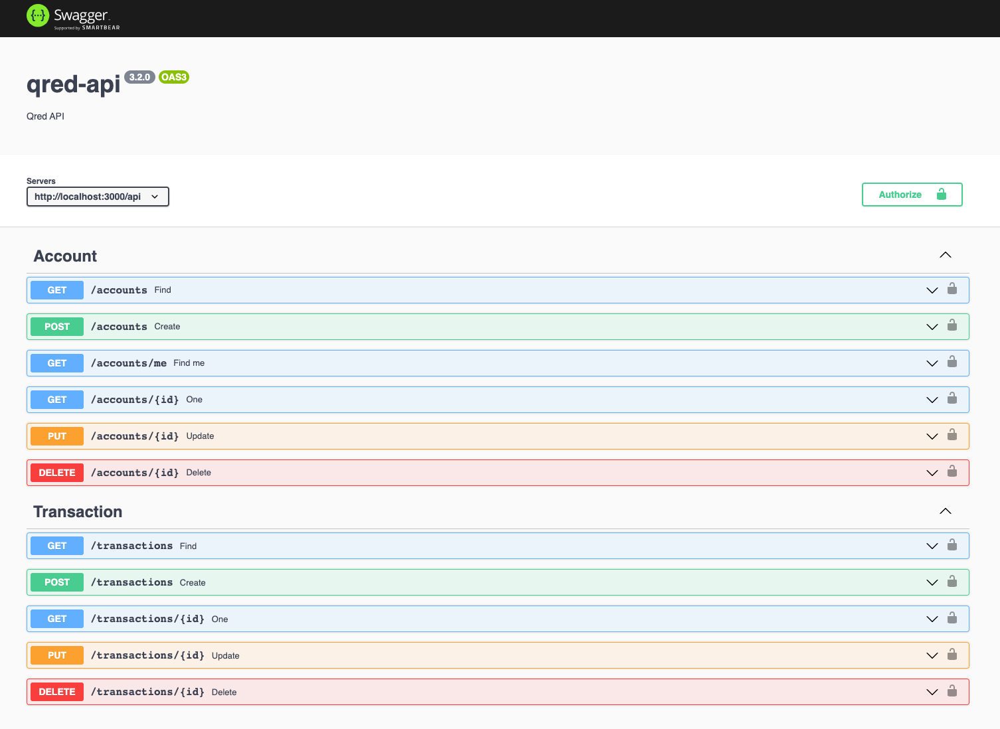
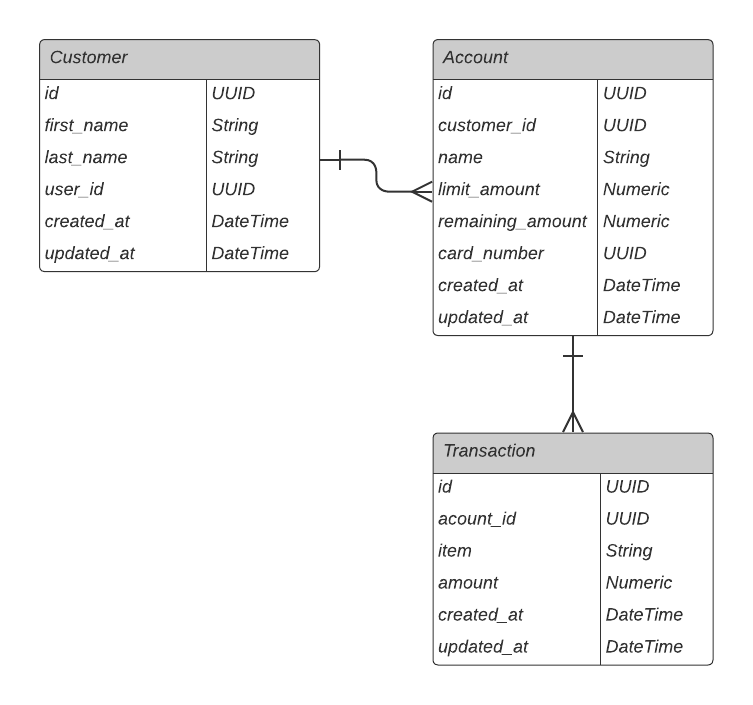

## ❯ How can development teams work in parallel?

### API-First Approach

- Creating a contract between services that is followed by teams.
- It also often involves additional planning and collaboration with the stakeholders providing feedback on the design of an API before any code is written.
- Teams can mock APIs and test API dependencies based on the established API definition.
- There are a lot of good API design tools like Swagger.

## ❯ Swagger

- Describes the structure of the API and serves as interactive API documentation.



### Entity Relationship Diagram



## ❯ API Routes

The route prefix is `/api`.

| Route          | Description |
| -------------- | ----------- |
| **/api**       | Shows us the name, description and the version of the package.json |
| **/swagger**   | This is the Swagger UI with our API documentation |
| **/api/accounts** | Account entity endpoint |
| **/api/transactions**  | Transaction entity endpoint |

## ❯ Project Structure

| Name                              | Description |
| --------------------------------- | ----------- |
| **src/**                          | Source files |
| **src/api**                       | REST API implementation |
| **src/api/middlewares/**          | Express Middlewares like helmet security features |
| **src/api/controllers/**          | REST API Controllers |
| **src/api/services/**             | Service layer contains the business logic, which uses the repository and other services. |
| **src/api/models/**               | TypeORM Models |
| **src/api/repositories/**         | Repository / DB layer |
| **src/loaders/**                  | Loader is a place where you can configure your app |
| **src/public/**                   | Static assets (fonts, css, js, img). |
| **test**                          | Tests |
| **test/e2e/** *.test.ts           | End-2-End tests (like e2e) |
| **test/integration/** *.test.ts   | Integration test with SQLite3 |
| **test/unit/** *.test.ts          | Unit tests |

## ❯ Getting Started

### Set up the Development Environment

You need to set up your development environment before you can do anything.

Install [Node.js and NPM](https://nodejs.org/en/download/)

- on OSX use [homebrew](http://brew.sh) `brew install node`
- on Windows use [chocolatey](https://chocolatey.org/) `choco install nodejs`

Install yarn globally

```bash
yarn global add yarn
```

### Run the API

Go to the project dir and start your app with this yarn script.

```bash
yarn start serve
```

> This starts a local server using `nodemon`, which will watch for any file changes and will restart the server according to these changes.
> The server address will be displayed to you as `http://0.0.0.0:3000`.

## ❯ Scripts and Tasks

All script are defined in the `package-scripts.js` file, but the most important ones are listed here.

### Install

- Install all dependencies with `yarn install`

### Linting

- Run code quality analysis using `yarn start lint`. This runs tslint.
- There is also a vscode task for this called `lint`.

### Tests

- In-progress

## ❯ To improve

### 1. Authentication and Authorization

### 2. Unit, Integration, and E2E testing

### 3. Proper error codes and API versioning

### 4. DDoS and brute force attacks

## ❯ License

[MIT](/LICENSE)
